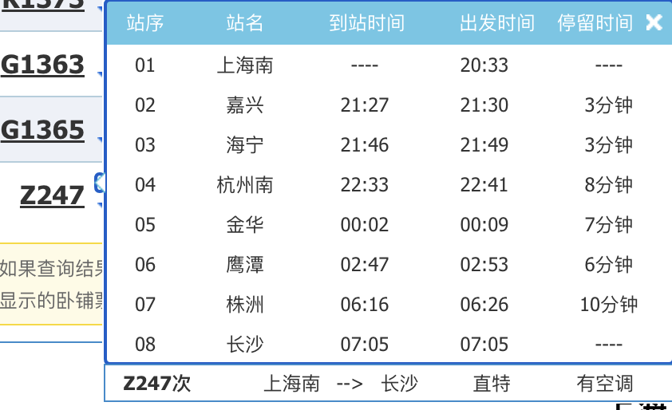
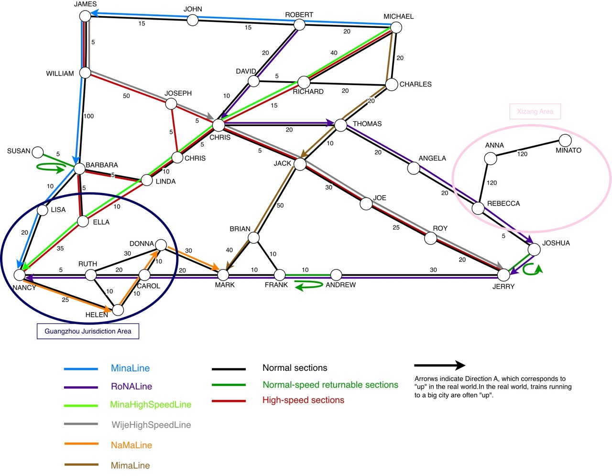
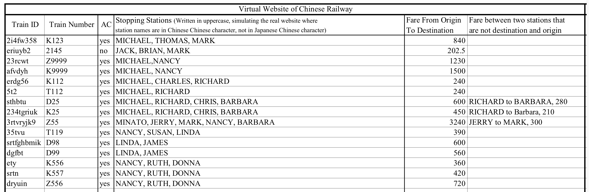

# Spring 2018 Semester Class Project: Virtual Chinese Passenger Train Route Reverse Engineering
China has 2000 major passenger stations that constitute more than 10,0000km of network. As a Chinese railway fun, I wish to travel on as many train routes as possible. But the official website of the China Railway ([12306.cn](https://www.12306.cn/index/)) only provides fare and stopping stations of a train; it does not reveal the exact route the train takes. This is disappointing, as there can be numerous potential routes for a given stopping station list.

Fortunately, the fare of a Chinese train is a complex yet (almost) deterministic function of its running distance, speed type, seat type, passing districts, and availability of air conditioning. This means that I can reverse-engineer a train's route from the available information on the China Railway website. 

In this class project, I created a virtual model for the Chinese rail network and implemented a depth-first algorithm to determine the train route based on user input of fare and origin/destination stations. Experiments with real Chinese train network with real Chinese train data are upcoming.

# How to Run
Enter `src/` directory. Compile Main.java by `javac *.java`. Then run it with `java Main`. This will open a simple`JPanel` ui with its backend mechanism supported by `SearchAllThePossibleRoutesFromFare.java`.　

# Virtual Train Map Model Image

# Virtual Train List

# Reference
中国鉄道時刻研究会. *中国鉄道時刻表* [China Railway Timetable], Volume3. 2016. 

<!---

--- any comments ---

-->
